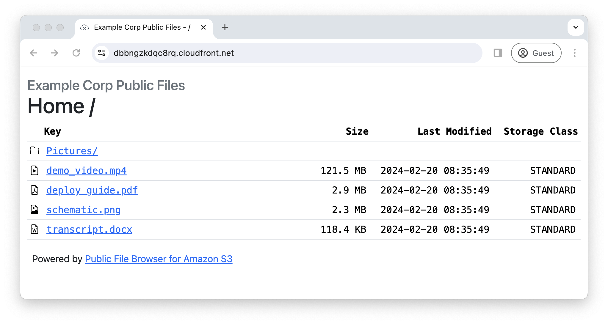
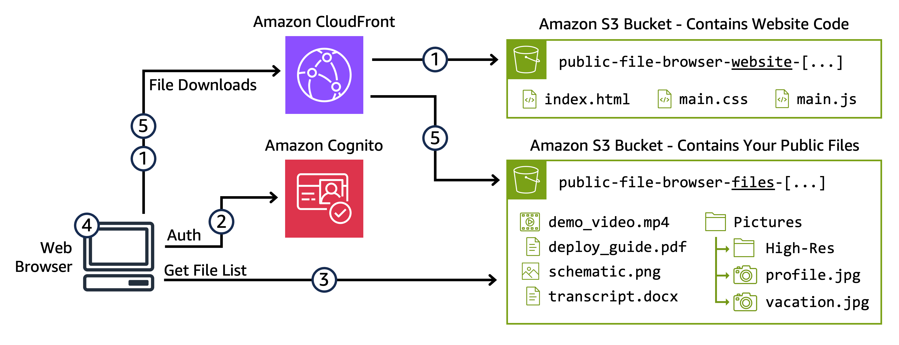

# Public File Browser for Amazon S3

AWS Storage Blog: [Creating a simple public file repository on Amazon S3](https://aws.amazon.com/blogs/storage/)

This AWS Samples code allows customers to create a simple PUBLIC file repository using Amazon S3 and Amazon CloudFront.
This sample code deploys a website and a public files S3 bucket which can be loaded with any files they wish to publish
publicly online.



## Architecture



1. User accesses static website via CloudFront CDN (contents of S3 "***Website***" Bucket)
2. Static website loads and browser obtains temporary credentials from Cognito
3. Cognito credentials are used to list files in the public S3 "Files" Bucket
4. Directory and file tree is rendered in the browser
5. User clicks any file to download via CloudFront CDN (contents of S3 "***Files***" Bucket)

## Deployment Instructions

The solution is packaged as an automated deployment via the [AWS Serverless Application Model (SAM)](https://aws.amazon.com/serverless/sam/) CLI.

### Prerequisites

For this walkthrough, you need to have the following prerequisites:

- An [AWS account](https://portal.aws.amazon.com/billing/signup)
- [AWS SAM CLI](https://docs.aws.amazon.com/serverless-application-model/latest/developerguide/serverless-sam-cli-install.html) installed and set up with [credentials](https://docs.aws.amazon.com/serverless-application-model/latest/developerguide/serverless-getting-started-set-up-credentials.html)
- Python 3.11 Installed and in your PATH variable
- Choose a region where the required services below are supported. Most AWS commercial regions are supported, but consult the [AWS Services by Region](https://aws.amazon.com/about-aws/global-infrastructure/regional-product-services/) page for details.
  - Amazon CloudFront (including [Standard Log support](https://docs.aws.amazon.com/AmazonCloudFront/latest/DeveloperGuide/AccessLogs.html#access-logs-choosing-s3-bucket))
  - Amazon S3
  - Amazon Cognito
  - AWS CloudFormation
  - AWS Lambda
  - As of March 2024, these are the supported regions:
    - US East (N. Virginia)
    - US East (Ohio)
    - US West (N. California)
    - US West (Oregon)
    - Canada (Central)
    - Europe (Frankfurt)
    - Europe (Ireland)
    - Europe (London)
    - Europe (Paris)
    - Europe (Stockholm)
    - Asia Pacific (Mumbai)
    - Asia Pacific (Osaka)
    - Asia Pacific (Seoul)
    - Asia Pacific (Singapore)
    - Asia Pacific (Sydney)
    - Asia Pacific (Tokyo)
    - South America (São Paulo)


### Build and Deploy

[Download](https://docs.github.com/en/repositories/creating-and-managing-repositories/cloning-a-repository) the source code and extract locally: [AWS Samples - Public File Browser for Amazon S3](https://github.com/aws-samples/public-file-browser-for-amazon-s3)

1. In a terminal, navigate to the `./sam/` directory
2. Run the following command to build and package the project for deployment:\
`sam build`
3. Deploy the SAM template to your account. The wizard will guide you through the process of deploying the SAM [AWS CloudFormation](https://aws.amazon.com/cloudformation/). Details on this process are found in the [sam build documentation](https://docs.aws.amazon.com/serverless-application-model/latest/developerguide/sam-cli-command-reference-sam-build.html).
   1. Run the following command: \
      `sam deploy --guided --capabilities CAPABILITY_NAMED_IAM`
   2. Select the supported AWS Region you chose in the prerequisites section.
   3. Enter values for the deployment parameters
      1. Stack Name - Choose a unique CloudFormation stack name. End users do not see this.
      2. AWS Region - The supported AWS Region you chose in the Prerequisites section.
      3. `SiteName` - Publicly visible title for the site, shown on the top of the page and in the title bar.
      4. `FilesOpenTabMode` -  How do you want the browser to react when a user selects a file in the following interface values. `In New Tab` is recommended over `In Same Tab`.
      5. `VisibleStorageClasses` - Comma delimited list of storage classes to show. Recommend keeping this default.
      6. `CrossOriginRestriction` - Browser security setting, set to `*` for first deployment, then see Step 6.
   4. Select the default inputs for the remaining items with the last prompt before deployment being:\
      `Deploy this changeset?`
4. Wait for the deployment to complete. This process takes approximately five minutes with a final prompt stating:\
   `Successfully created/updated stack - [STACK-NAME] in [REGION]`
5. Once the deployment completes, note the following entries in the Outputs section.
   1. `FileBrowserURL` - This URL is for the public web interface. Needed in Step 6.
   2. `PublicFilesBucket` - The name of the S3 bucket for storing PUBLICLY ACCESSIBLE files that display in the user browser.
   3. `WebInterfaceAppBucket` - The name of the S3 bucket that stores the code that runs the file browser web interface.
6. IMPORTANT: Complete Steps 3 and 4 again, keeping all values the same except for the `CrossOriginRestrictio`n parameter, and input the value from the `FileBrowserURL` output in Step 5. For example:\
   `Parameter CrossOriginRestriction [*]: https://d111111abcdef8.cloudfront.net`

This concludes the deployment of the Public File Browser for Amazon S3 web application. AWS SAM CLI uses [AWS CloudFormation](https://aws.amazon.com/cloudformation/) to orchestrate the deployment of the front-end static website and public file storage bucket. The entire application is deployed.

### Usage

To add files to the public interface simply move files into the S3 Bucket indicated in the `PublicFilesBucket` output from the above SAM Deploy command. The bucket name should start with `public-file-browser-files-` followed by a random string.

Note that this solution has [Amazon S3 Versioning](https://docs.aws.amazon.com/AmazonS3/latest/userguide/Versioning.html) enabled for all data, which could result in deleted data being retained and incurring costs. See the Security section below for details.

## Frequently Asked Questions

### How much does this solution cost to operate?

This is an entirely serverless solution. Therefore, costs are directly related to usage, both in data storage and data
retrieval by end users. Reference below and consult the [S3](https://aws.amazon.com/s3/pricing/) and
[CloudFront](https://aws.amazon.com/cloudfront/pricing/) pricing pages.

- Static Costs
  - A few cents monthly to store the website source code in S3 Standard
  - S3 data storage costs for the public files and logging buckets
    - Free Tier: 5GB Per Month for First 12 Months
- Costs for End User Access
  - CloudFront data transfer
    - Free Tier: 1TB Per Month
  - S3 LIST/GET request costs
    - Free Tier: 2,000 Page Views and 20,000 Downloads for First 12 Months
    - Note: There is NO CHARGE for S3 Data Transfer to CloudFront

### How are objects listed in the interface?

S3 object/prefix lists are ordered lexicographically (UTF-8 byte order). For this to make sense in most use cases the
solution automatically switches between two modes:
- Less than or equal to 1000 Objects/Prefixes
   - Sort how most filesystems do (lexicographically with folders always on top)
   - This makes the system make intuitive sense for 99% of listings and views
- Greater than 1000 Objects
   - Strictly lexicographically so folders may be interspersed
   - While this is less intuitive it is consistent without listing the entire bucket. Listing the entire bucket would 
     inflate costs and load times unnecessarily. The alternative would be to take each page and treat it as above but
     this leads to odd ordering that almost seems random since the top of one page is not always the next object of the
     previous page (it is all the next folders lexicographically).

### How do I move files into the `public-file-browser-files-[...]` quickly in bulk?

Sync from a local system:
- [How-To Guide: Batch Upload Files to Amazon S3 Using the AWS CLI](https://aws.amazon.com/getting-started/hands-on/backup-to-s3-cli/)
- [Use high-level (s3) commands with the AWS CLI](https://docs.aws.amazon.com/cli/latest/userguide/cli-services-s3-commands.html)
- [Synchronizing your data to Amazon S3 using AWS DataSync](https://aws.amazon.com/blogs/storage/synchronizing-your-data-to-amazon-s3-using-aws-datasync/)

For large uploads:
- [How do I use the AWS CLI to upload a large file in multiple parts to Amazon S3?](https://repost.aws/knowledge-center/s3-multipart-upload-cli)
- [How can I optimize performance when I upload large files to Amazon S3?](https://repost.aws/knowledge-center/s3-upload-large-files)

If your files are already in a different Amazon S3 bucket:
- [How can I copy all objects from one Amazon S3 bucket to another bucket?](https://repost.aws/knowledge-center/move-objects-s3-bucket)
- For large Amazon S3 buckets with millions of files, consider using [S3 Batch Operations](https://docs.aws.amazon.com/AmazonS3/latest/userguide/batch-ops-examples-copy.html)

### How do I use this solution with my own DNS domain name (such as `publicfiles.example.com`) instead of the CloudFront name?

See [How can I configure CloudFront to serve my content using an alternate domain name over HTTPS?](https://repost.aws/knowledge-center/cloudfront-https-content)
- Note that you have to [update the Cross-Origin Resource Sharing (CORS) rules](https://repost.aws/knowledge-center/s3-configure-cors) in the Amazon S3 configuration of BOTH the files and website S3 buckets.
- See also: [Using custom URLs by adding alternate domain names (CNAMEs)](https://docs.aws.amazon.com/AmazonCloudFront/latest/DeveloperGuide/CNAMEs.html)

### How do I modify the public user interface, such as to add text, change the style, or add my logo?

The public website files are located in the `public-file-browser-website-[...]` bucket. These files can be downloaded, modified, and re-uploaded containing customizations. Note that CloudFront caches these files, so you must create an invalidation to clear the cache when a file is updated. See [How do I remove a cached file from CloudFront](https://repost.aws/knowledge-center/cloudfront-clear-cache)?

If you choose to update the files in the `./website/` directory of the source code repository for future deployments, then you must update the `./sam/seed_s3_data/website.zip` by following the instructions in the repository’s `README.md` file.


## Security

As a best practice, the solution enables the following features:

- [Amazon CloudWatch distribution access logs](https://docs.aws.amazon.com/AmazonCloudFront/latest/DeveloperGuide/AccessLogs.html)
  - Stored in an S3 bucket: `public-file-browser-logging-[...]`
- [Amazon S3 bucket access logs (static website and uploaded images)](https://docs.aws.amazon.com/AmazonS3/latest/userguide/ServerLogs.html)
  - Stored in an S3 bucket: `public-file-browser-logging-[...]`
- [Amazon S3 Versioning](https://docs.aws.amazon.com/AmazonS3/latest/userguide/Versioning.html)
  - This feature is enabled for all S3 buckets, such as the primary `public-file-browser-files-[...]` bucket used to store public files. This means all data written to the S3 bucket is retained as a “previous version”, even if overwritten or deleted. You incur charges for storing previous versions of objects.
  - If you expect to replace or update files with the same name frequently, then you should configure the S3 bucket with a [Lifecycle Configuration](https://docs.aws.amazon.com/AmazonS3/latest/userguide/object-lifecycle-mgmt.html) to expire noncurrent object versions. See [How do I create Amazon S3 lifecycle configuration rules for noncurrent object versions?](https://repost.aws/knowledge-center/s3-lifecycle-rule-non-current-version)
- [Default Encryption-at-Rest for all objects stored in Amazon S3](https://docs.aws.amazon.com/AmazonS3/latest/userguide/default-encryption-faq.html)
- [Default TLS Version Options (TLSv1)](https://repost.aws/knowledge-center/cloudfront-security-protocols-ciphers)
  - To simplify deployment, this solution uses the default CloudFront domain and certificate that limits the available TLS version options to TLSv1. To use another [supported TLS version](https://repost.aws/knowledge-center/cloudfront-security-protocols-ciphers) follow the instructions above to use a custom domain, [new certificate](https://docs.aws.amazon.com/AmazonCloudFront/latest/DeveloperGuide/cnames-and-https-requirements.html), and configure the [Security Policy](https://docs.aws.amazon.com/AmazonCloudFront/latest/DeveloperGuide/secure-connections-supported-viewer-protocols-ciphers.html) on the CloudFront distribution.


See [CONTRIBUTING](CONTRIBUTING.md#security-issue-notifications) for more information.

## Development

Run the following from the website directory using [local-web-server](https://www.npmjs.com/package/local-web-server):

```bash
> ws -r '/ -> index.html' '/pfb_for_s3/(.*) -> /$1' --log.format dev
```

### Automatic Deployment Note
The file `./sam/seed_s3_data/website.zip` contains a statically zipped copy of the `./website/` directory. This
zip file is used to automatically load the `public-file-browser-website-[...]` bucket with the actual website code
during deployment. Before re-deploying you will need to re-create `./sam/seed_s3_data/website.zip` using the command
below from the root of the repository. You may then follow the [DEPLOYMENT](./docs/DEPLOYMENT.md) guide.

```bash
> zip -FS -x "*.DS_Store" -r ./sam/seed_s3_data/website.zip website
```

## License

This library is licensed under the MIT-0 License. See the [LICENSE](LICENSE) file.
